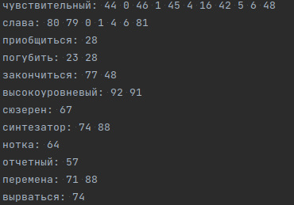

# Обратный индекс

### Константы:

**RESULT_FILE** - Путь сохранения файла с обратным индексом

**LEMMAS_FILE** - Файл с леммами

### Запуск:

_Индексация лемм из файла с путем **LEMMAS_FILE**_

Запустить функцию main() в файле Indexer.kt

### Результат:

Создание файла обратного индекса с путем **RESULT_FILE**

# Булев поиск

### Константы:

**LEMMA_TOKENS_FILE** - Файл обратного индекса

### Запуск:

_Булев поиск (AND, OR) по обратному индексу из **LEMMA_TOKENS_FILE**_

Запустить функцию main() в файле BooleanSearch.kt

### Результат:

Вывод результата в консоль

