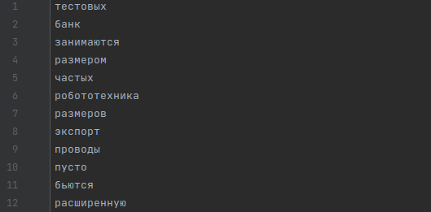
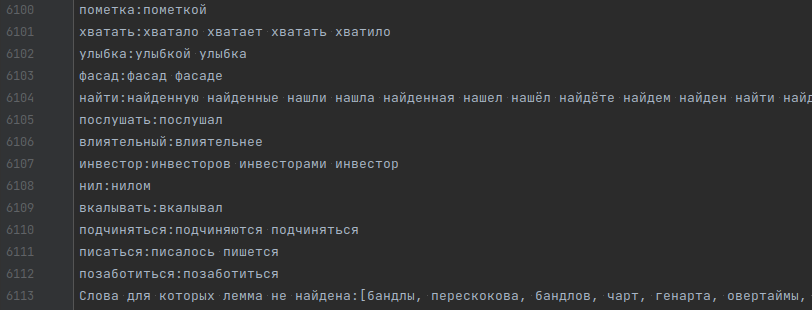

# Токенизация и разбиение на леммы

### Input:

HTML страницы из папки, путь к которой указан в in

### Processing:

Парсит текст страниц из папки in. Выделяет токены. Разбивает на группы по леммам.

### Output

- **tokens.txt** - токены

- **lemmas.txt** - токены, разбитые на группы по леммам

